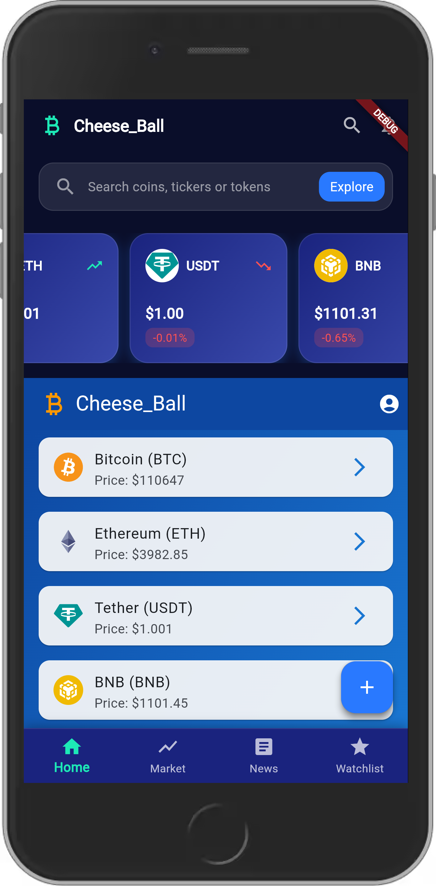
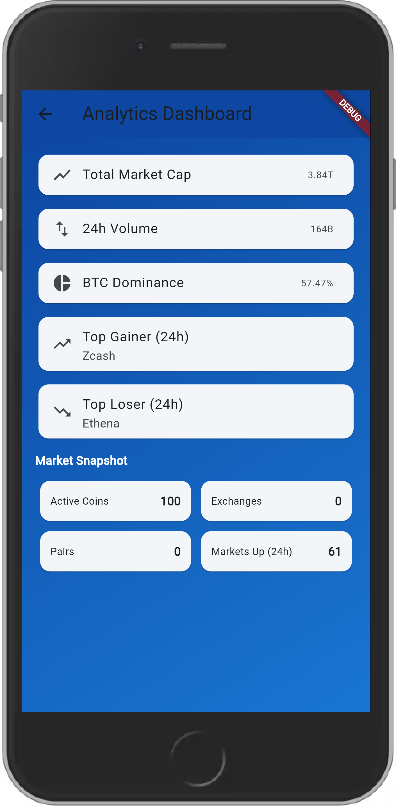
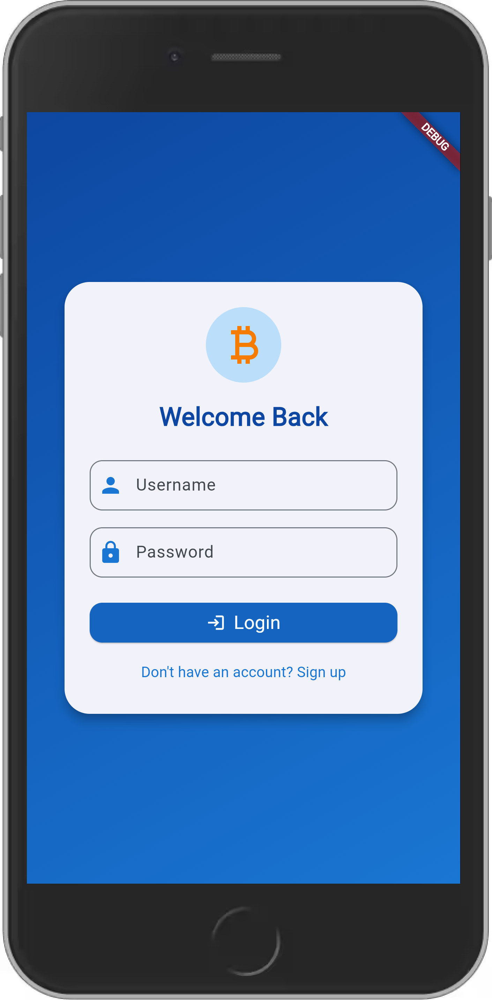

# 🚀 Crypto Tracker App

A **powerful, real-time cryptocurrency tracker** built with **Flutter (frontend)** and **FastAPI (backend)**.  
This app allows users to view live market data, track coin performance, check price charts, and view detailed analytics for every coin — all in a modern, smooth UI.

---

## 📱 Screenshots

| Home Screen | Coin Details | Search | Portfolio | Analytics |
|--------------|---------------|----------|-------------|-------------|
|  |  |  |  |  |

> 📸 *(Add your actual screenshots inside a `/screenshots` folder in the root of your project.)*

---

## 🧠 Features

✅ Live Cryptocurrency Prices (via FastAPI backend + external APIs)  
✅ Detailed Coin Information (name, price, supply, volume, market cap, charts)  
✅ Advanced Search and Filtering  
✅ Light/Dark Mode  
✅ Auto Refresh and Real-Time Updates  
✅ Modern UI with Smooth Animations  
✅ FastAPI-powered backend with robust endpoints  
✅ Fully Responsive Design (mobile + web)  
✅ Built-in Error Handling and Offline Safety  

---

## 🛠️ Tech Stack

| Layer | Technology |
|-------|-------------|
| **Frontend** | Flutter (Dart) |
| **Backend** | FastAPI (Python) |
| **Database** | PostgreSQL / SQLite |
| **HTTP Client** | Dio (Flutter) |
| **State Management** | Provider / Riverpod |
| **API Testing** | Postman |
| **Deployment** | Render / Railway / Vercel (for FastAPI), Firebase (for Flutter Web) |

---

## ⚙️ Installation & Setup

### 🧩 1. Clone the Repository

```bash
git clone https://github.com/<your-username>/crypto-tracker.git
cd crypto-tracker


🖥️ 2. Backend (FastAPI)

Navigate into the backend folder:

cd backend


Create a virtual environment:

python -m venv venv
source venv/bin/activate   # On Windows: venv\Scripts\activate


Install dependencies:

pip install -r requirements.txt


Run the FastAPI server:

uvicorn main:app --reload


Visit:

API Docs: http://127.0.0.1:8000/docs

Coins Endpoint: http://127.0.0.1:8000/coins

📱 3. Frontend (Flutter)

Navigate to frontend:

cd ../frontend


Get dependencies:

flutter pub get


Run the app:

flutter run


Make sure your FastAPI backend is running before starting the Flutter app.

🔑 Environment Variables

Create a .env file in your backend directory with:

API_KEY=your_coinstats_or_coinmarketcap_api_key
DATABASE_URL=sqlite:///./crypto.db

🧮 API Endpoints
Method	Endpoint	Description
GET	/coins	Get all available coins
GET	/coins/{id}	Get detailed info about a coin
GET	/news	Latest crypto news
GET	/market	Market summaries
POST	/watchlist/add	Add coin to watchlist
DELETE	/watchlist/remove/{id}	Remove from watchlist
🧰 Folder Structure
crypto-tracker/
├── backend/
│   ├── main.py
│   ├── routes/
│   ├── models/
│   ├── database.py
│   ├── requirements.txt
│   └── .env
│
├── frontend/
│   ├── lib/
│   │   ├── screens/
│   │   ├── widgets/
│   │   ├── services/
│   │   └── main.dart
│   ├── pubspec.yaml
│
└── screenshots/
    ├── screen1.png
    ├── screen2.png
    ├── screen3.png
    ├── screen4.png
    └── screen5.png

🌍 Deployment
🖥 Backend (FastAPI)

Deploy easily to Render, Railway, or Vercel:

uvicorn main:app --host 0.0.0.0 --port $PORT

📱 Frontend (Flutter Web)

Build your release version:

flutter build web


Then deploy the /build/web folder to Firebase Hosting or Netlify.

🧠 Future Improvements

🔔 Push notifications for major price changes

💹 Interactive charts using fl_chart

📊 User authentication and watchlist syncing

🪙 Wallet integration

🌐 Multi-language support

💬 Contributing

Contributions are welcome!

Fork the project

Create a feature branch

Commit your changes

Open a pull request 🎉

👨‍💻 Author

Developer: [Kehinde]
📧 Email: adelerekehinde01@gmail.com

🌐 Portfolio: https://kehinde329.vercel.app

🪙 License

This project is licensed under the MIT License — see the LICENSE
 file for details.

⭐ If you like this project, don’t forget to give it a star!


---

### 🧩 Notes for You:
- Put your screenshots in `/screenshots/` folder named `screen1.png` → `screen5.png`.
- Replace `<your-username>` and contact details.
- Adjust the backend URL if you deploy to cloud (instead of localhost).

---

Would you like me to **include a live API testing example (using Postman or `curl`)** in the README as well?  
That would make it even stronger for GitHub reviewers and recruiters.
